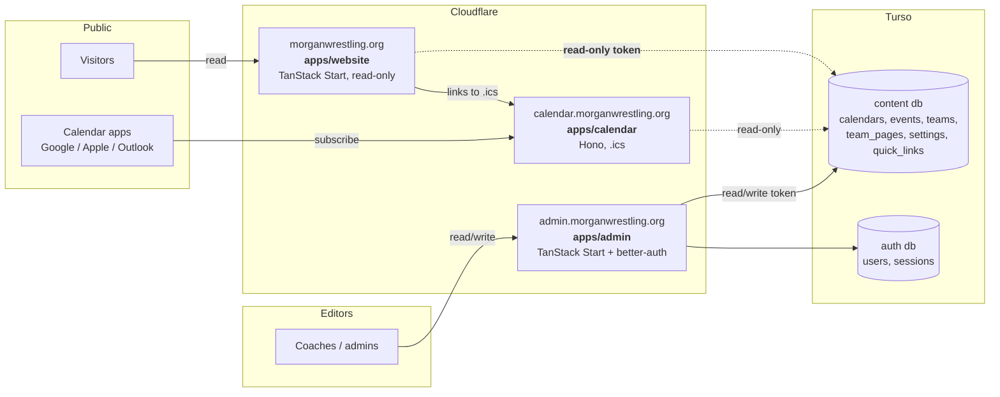
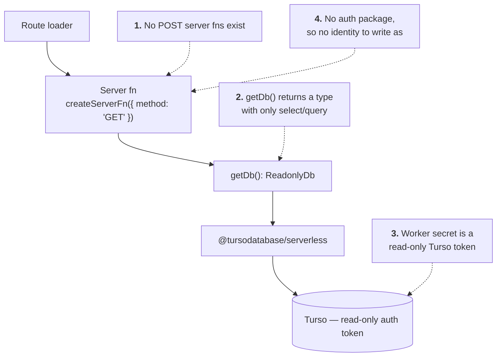
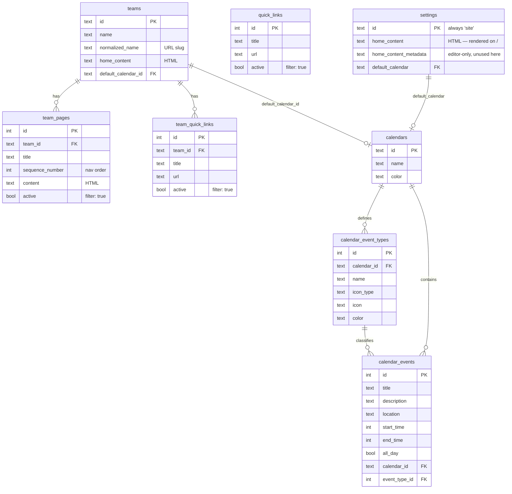
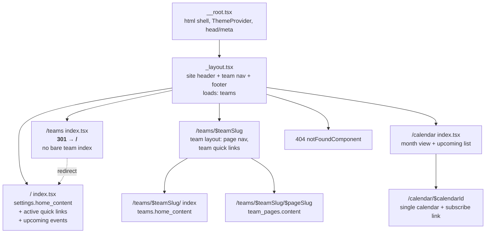

# `@morgan-wrestling/website`

The public, read-only face of Morgan Wrestling. A TanStack Start app on
Cloudflare Workers that renders whatever the admin app has written into Turso —
site home content, teams and their pages, quick links, and the calendar — and
never writes a row back.

> **Status: the home page is live (M1–M3).** The app builds, typechecks, tests,
> and serves `/` with the real site content, the real quick links, and a header
> nav driven by the team list. Teams, calendar, polish and deploy are still
> ahead. This file is the design and the build order — delete the "Milestones"
> section once the app ships.

---

## 1. Goals and non-goals

### Goals

- Render the site content authored in `apps/admin` for anonymous visitors.
- Server-render everything. This is a content site — it should be fast, crawlable,
  and readable with JavaScript off.
- Be structurally incapable of mutating the database, at more than one layer.
- Reuse the workspace packages (`db`, `ui`, `styles`) rather than growing a
  parallel copy of them.

### Non-goals

- **No authentication.** `@morgan-wrestling/auth` is deliberately not a
  dependency. There are no sessions, no cookies, no user rows, and no
  `BETTER_AUTH_*` secrets on this Worker. Every visitor sees the same page.
- **No writes.** No `createServerFn({ method: 'POST' })`, no forms, no mutations.
- **No `.ics` generation.** `apps/calendar` already serves subscribable
  calendars at `calendar.morganwrestling.org`; the website links to it.
- **No admin-only content.** Rows flagged inactive (`team_pages.active`,
  `quick_links.active`, `team_quick_links.active`) are filtered out server-side.

---

## 2. Where it sits



Three Workers, one content database, one writer. The website and the calendar
worker are both pure readers; only the admin app holds a read/write token.

---

## 3. Stack

Matched to `apps/admin` so the two apps stay maintainable together, minus
everything auth- and mutation-shaped.

| Concern | Choice | Notes |
| --- | --- | --- |
| Framework | TanStack Start (`@tanstack/react-start`) | File-based routing, server functions, SSR. |
| Runtime | Cloudflare Workers via `@cloudflare/vite-plugin` | Same as admin: `main: "@tanstack/react-start/server-entry"`. |
| Build | Vite 8 | `resolve.tsconfigPaths` + the admin's `optimizeDeps` workaround if a transitive dep bites. |
| Data | `@morgan-wrestling/db` (drizzle + `@tursodatabase/serverless`) | Schema and query helpers come from the package; the app never depends on `drizzle-orm` directly. |
| Data fetching | Router loaders + `@tanstack/react-query` + `@tanstack/react-router-ssr-query` | Mirrors `apps/admin/src/router.tsx`. |
| UI | `@morgan-wrestling/ui`, `@morgan-wrestling/styles` | Shared shadcn/base-ui components and the design tokens. |
| Styling | Tailwind v4 + `@tailwindcss/typography` | Typography is **new** here — see §7. |
| Env | `@t3-oss/env-core` + zod | Same shape as `apps/calendar/src/env.ts`, which is the minimal one. |
| Sanitizing | `ultrahtml` | Its *parser*, not its sanitize transformer — see §7. |
| Lint/format | Root Biome | Tabs, single quotes, sorted classes. Nothing app-local. |
| Tests | Vitest + Testing Library | `vitest.config.ts` is separate from `vite.config.ts`: the app config boots a Worker, and the units worth testing are plain modules. |

### Dependencies to add

```jsonc
{
  "dependencies": {
    "@fontsource-variable/geist": "*",
    "@morgan-wrestling/db": "workspace:*",
    "@morgan-wrestling/styles": "workspace:*",
    "@morgan-wrestling/ui": "workspace:*",
    "@t3-oss/env-core": "*",
    "@tanstack/react-query": "*",
    "@tanstack/react-router": "*",
    "@tanstack/react-router-ssr-query": "*",
    "@tanstack/react-start": "*",
    "date-fns": "*",
    "lucide-react": "*",
    "react": "*",
    "react-day-picker": "*",
    "react-dom": "*",
    "ultrahtml": "*",
    "zod": "*"
  }
}
```

Match the versions already pinned in `apps/admin/package.json` — one resolved
copy of React/Router/Query across the workspace is the point.

Deliberately **absent**: `@morgan-wrestling/auth`, `@tanstack/react-form`,
`@tanstack/react-form-start`, `nanoid`, `jotai`. If a future change wants any of
them, that is a signal the app is drifting out of its read-only lane.

---

## 4. Read-only, enforced in four places

"Read only" is a property that has to be defended, not just intended. Four
independent layers, so no single mistake makes the site writable:



**1 — No write server functions.** The app defines only
`createServerFn({ method: 'GET' })` handlers under `src/lib/*-fns.ts`. Reviewing
this is a one-line grep, which is the point.

**2 — A narrowed db handle.** `src/db/index.ts` deliberately does *not*
re-export the full drizzle instance. It returns:

```ts
export type ReadonlyDb = Pick<AppDb, 'select' | 'selectDistinct' | '$count'>;
```

**`with` is excluded on purpose.** In `drizzle-orm@1.0.0-rc.4` the object
returned by `db.with(...)` carries its own `insert`, `update` and `delete`
(`sqlite-core/async/db.d.ts:92-103`), so keeping it in the `Pick` would hand
back the entire write path through the back door. The cost is CTEs; if a query
ever genuinely needs one, add a wrapper that forwards only `with(...).select`
rather than widening the type.

Verified — each of these is a `TS2339` against `ReadonlyDb`, while
`getDb().select().from(...)` compiles:

| Expression | Result |
| --- | --- |
| `getDb().select()` | ✅ compiles |
| `getDb().insert(t)` | ❌ `Property 'insert' does not exist` |
| `getDb().update(t)` | ❌ `Property 'update' does not exist` |
| `getDb().delete(t)` | ❌ `Property 'delete' does not exist` |
| `getDb().run(sql)` | ❌ `Property 'run' does not exist` |
| `getDb().transaction(fn)` | ❌ `Property 'transaction' does not exist` |
| `getDb().with(...)` | ❌ `Property 'with' does not exist` |

Re-run that probe after any `drizzle-orm` bump: a `Pick` on a key that no longer
exists is a silent no-op, so a rename upstream would quietly reopen the hole.

**3 — A read-only Turso token.** The Worker secret is minted with
`turso db tokens create <db> --read-only`. Even a bug that got past layers 1–2
fails at the database. This is the only layer that is not bypassable from inside
the codebase, so it is the one that actually matters.

**4 — No writer identity.** Every mutable table carries `created_by`/`updated_by`
sourced from a better-auth session. With no auth package there is no session and
nothing valid to put in those columns.

---

## 5. The read surface

Everything the site renders, and nothing else:



Never selected: `created_by`, `updated_by`, `*_content_metadata` (the
ProseMirror JSON the editor round-trips), and anything from the auth database.
Select explicit column lists, as `apps/admin/src/lib/*-fns.ts` does — it keeps
audit columns off the wire and makes the public surface obvious at the call site.

### `active` is fail-closed

`team_pages.active`, `quick_links.active` and `team_quick_links.active` are all
nullable, and the admin does not filter on them today. **The website treats
`NULL` as hidden**: every public query filters `eq(table.active, true)`, so a
row is visible only when someone explicitly published it.

This is the fail-closed reading, and the one that matters for an anonymous,
edge-cached site — the failure mode of the alternative is a half-written page
going live by accident, which is worse than a published page needing one extra
click in the admin.

Two consequences to expect:

- Rows created before the flag was used may have `NULL` and will be invisible
  until toggled on. That is the intended migration path, not a bug — but say so
  when the site goes live, or it reads as missing content.
- `quick_links.active` and `team_quick_links.active` default to `false`, so new
  links are hidden until published. `team_pages.active` has *no* default, so a
  page inserted without it is `NULL` and therefore hidden. Both land in the same
  place, by different routes.

If this turns out to be the wrong default in practice, the fix is a backfill
plus `NOT NULL` on the column — a shared-schema change, so it belongs in
`packages/db` and the admin, not in a special case here.

---

## 6. Routes



Quick links sit on the home page rather than in the layout chrome, because
that is where the admin puts them: `apps/admin/.../home-page.tsx` edits them
with `scope='site'` next to the home content, and the team ones live on the
team page the same way. The layout loads only the team list, which is the one
query every page needs.

Plus two non-React responses:

- `/robots.txt` — allow all, point at the sitemap.
- `/sitemap.xml` — generated from teams + active team pages, via a route
  `server.handlers.GET` (see the "API Routes" pattern in the root `README.md`).

### `/teams` has no page

There is no bare team index. The site header already lists every team, so a
visitor who lands on `/teams` — a trimmed URL, an old link, a crawler guessing —
is sent home to pick one from the nav instead of being shown a redundant list.

The redirect is thrown from `beforeLoad`, not from a component, so it resolves
during SSR:

```ts
export const Route = createFileRoute('/_layout/teams/')({
	beforeLoad: () => {
		throw redirect({ to: '/', statusCode: 301 });
	},
});
```

A component-level redirect would ship an empty shell that bounces after
hydration; this returns a real `301` with `location: /` on the first response,
which is also what keeps the duplicate URL out of search indexes. Verified
against the dev server:

```
$ curl -sI localhost:3001/teams
HTTP/1.1 301 Moved Permanently
location: /
```

`301` (permanent) rather than `302` because this is a standing decision, not a
temporary state — if a real team index is ever wanted, note that browsers and
crawlers cache a 301 aggressively and the change will be slow to propagate.

### The `$pageSlug` problem

`team_pages` has `title` and `sequence_number` but **no slug column**, and titles
are not unique per team. Three options:

| Option | URL | Cost |
| --- | --- | --- |
| **A.** Numeric id | `/teams/varsity/7` | Ugly, and page ids leak. No schema change. |
| **B.** Slugify the title at read time | `/teams/varsity/schedule` | Pretty. Ambiguous if two pages in a team normalize to the same slug. |
| **C.** Add `team_pages.slug` (unique per team) | `/teams/varsity/schedule` | Correct. Needs a migration + an admin field. |

**Recommendation: B now, C later.** Slugify with the same
`name.toLowerCase().replace(/\s+/g, '-')` rule `apps/admin/src/lib/team-fns.ts`
uses for teams, resolve server-side by comparing normalized titles, and on a
collision take the lowest `sequence_number` (matching the nav order the visitor
clicked). Ship C as a follow-up in the admin app when someone actually hits a
collision; the route shape does not change when it lands.

Teams themselves already have `normalized_name`, so `$teamSlug` needs no such
gymnastics.

### Request flow

```mermaid
sequenceDiagram
    participant B as Browser
    participant W as Worker (TanStack Start)
    participant L as Route loader
    participant F as Server fn (GET)
    participant D as getDb() — ReadonlyDb
    participant T as Turso (read-only)

    B->>W: GET /teams/varsity/schedule
    W->>L: match route, run loader
    L->>F: ensureQueryData(teamPageQueryOptions)
    F->>D: getDb()  (per request, never hoisted)
    D->>T: SELECT ... WHERE normalized_name = ? AND active = 1
    T-->>D: rows
    F-->>L: plain JSON (no audit columns)
    L-->>W: dehydrated query cache
    W-->>B: streamed HTML + hydration payload
    Note over B,W: Client navigations reuse the<br/>same query cache; no refetch<br/>within staleTime.
```

Loaders call `queryClient.ensureQueryData(...)` so the same query options serve
SSR and client navigation, exactly as the admin app does via
`setupRouterSsrQueryIntegration`.

---

## 7. Rendering authored content

`home_content` and `team_pages.content` are **HTML strings** produced by the
Tiptap editor — `packages/ui/src/components/text-editor/types.ts` says so
outright: *"`html` is what gets rendered on the public site"*. The sibling
`*_metadata` column holds the ProseMirror JSON and is editor-only; the website
ignores it.

So rendering is `dangerouslySetInnerHTML` inside a typography container:

```tsx
<article
  className='prose prose-neutral dark:prose-invert max-w-none'
  // biome-ignore lint/security/noDangerouslySetInnerHtml: authored HTML from
  // the admin editor, sanitized on the way out of the server fn.
  dangerouslySetInnerHTML={{ __html: html }}
/>
```

Two things this needs:

1. **`@tailwindcss/typography` must actually be loaded.** It is in the admin's
   devDependencies but no stylesheet references it, and `prose` is used nowhere
   in the repo today. Add `@plugin "@tailwindcss/typography";` to the website's
   `src/styles.css` (app-local, so the admin's bundle is unaffected).

2. **Sanitize server-side.** The authors are trusted admins, so this is
   defense-in-depth rather than a live threat — but the site is anonymous and
   cached, so a single bad paste would be served to everyone. `sanitizeHtml`
   in `src/lib/sanitize-html.ts` is the one helper every content-returning
   server fn calls, and it runs in the *server function*, so unsafe markup
   never crosses to the client.

### Why the sanitizer is hand-rolled over `ultrahtml`'s parser

`ultrahtml` is the right parser for a Worker — no DOM, no dependencies, and it
closes tags the author left open. Its bundled `transformers/sanitize` is **not**
a security boundary, though. Probed against 1.7.0 with
`allowElements: ['p','a']` and `allowAttributes: { href: ['a'] }`:

| Input | Output | Why |
| --- | --- | --- |
| `<p onclick="alert(1)">hi</p>` | unchanged | `allowAttributes` only *keeps* listed attributes; an unlisted one falls through both branches and survives |
| `<a href="javascript:alert(1)">` | unchanged | no scheme check anywhere |
| `<p title='a" onmouseover="alert(1)'>` | `<p title="a" onmouseover="alert(1)">` | `attrsToString` interpolates values without escaping `"`, so a value containing a quote breaks out of the attribute |
| `<P CLASS="X">upper</P>` | *empty* | names are matched case-sensitively, so uppercase markup is dropped wholesale |

The first three are live XSS with an allowlist that looks correct. So we keep
`parse` and walk the tree ourselves: elements and attributes are allowlisted by
name (lowercased first), URLs are scheme-checked *after* entity decoding so
`&#106;avascript:` is caught, `style` is narrowed to the `text-align` that
TextAlign emits, and serialization escapes what it writes.

Two things the allowlist has to keep, which a tighter one would break:

- **`class`, everywhere.** The editor's styling *is* class attributes —
  `packages/ui/.../extensions/headings.ts` and friends put Tailwind utilities
  into the stored HTML. They resolve on this site because
  `packages/styles/src/index.css` does `@source "../../../packages/ui/src"`,
  so the utilities are in the website's bundle too (verified: `text-4xl`,
  `list-disc`, `bg-amber-200` are all in `dist/client/assets/styles-*.css`).
- **Tags no extension is registered for yet.** `img` and the table tags are
  allowlisted even though the editor does not emit them today, so that turning
  those extensions on in the admin does not silently blank existing pages.

`src/lib/sanitize-html.test.ts` covers each row of that table plus the
round-trip of real editor output; run it after any `ultrahtml` bump.

---

## 8. Calendar display

### Which calendars are public

`calendars` has no `public` flag, so "every calendar" is not a safe default — an
internal or scratch calendar created in the admin would be world-readable the
moment it exists.

**A calendar is public only if something on the site references it:** it is
`settings.default_calendar`, or it is some team's `teams.default_calendar_id`.
`/calendar` lists exactly that set, and `/calendar/$calendarId` 404s for
anything outside it — otherwise the id is a guessable back door around the list.

```ts
// The public set, resolved once per request.
const publicCalendarIds = union(
  select settings.default_calendar where id = 'site',
  select distinct teams.default_calendar_id where not null,
);
```

Publishing a calendar is therefore an act of wiring it to the site in the admin,
which is a reasonable mental model. If it ever becomes too coarse — a team wants
two public calendars — that is the point to add `calendars.public` and switch
the filter; the route shape does not change.

### What a visitor sees

The calendar pages read from the same tables `apps/calendar` does. A visitor can:

- see a month grid with per-day event dots coloured by
  `calendar_event_types.color` (the `--calendar-*` tokens and the
  `calendarColors` map in `packages/ui/src/components/calendar/calendar-utils.ts`
  already exist for this),
- see an upcoming-events list with title, time, location, and type,
- click **Subscribe** → `https://calendar.morganwrestling.org/<calendarId>/calendar.ics`.

Queries are bounded by a date window, the same overlap logic
`apps/calendar/src/fns/create-calendar.ts` uses — keep any event that intersects
the window rather than only those fully inside it:

```ts
and(
  eq(calendarEvents.calendarId, calendarId),
  gte(calendarEvents.endTime, windowStart),
  lte(calendarEvents.startTime, windowEnd),
)
```

`apps/admin/src/components/big-calendar.tsx` is a scaffold with hard-coded dots,
not a reusable component. If the month grid ends up shared between the two apps,
promote a real one into `packages/ui`; until then build it in the website and
leave the admin's alone.

---

## 9. Caching and freshness

Content changes a few times a week; traffic is bursty around events. Layers,
cheapest first:

| Layer | Setting | Effect |
| --- | --- | --- |
| Query client | `staleTime: 5 * 60 * 1000` | No refetch on client navigation within the window. |
| Document response | `Cache-Control: public, max-age=0, s-maxage=300, stale-while-revalidate=3600` | Cloudflare's edge serves the HTML; a stale page refreshes in the background. |
| Static assets | Vite's hashed filenames + immutable | Free. |

**There is no cache invalidation.** `caches.default.delete()` only purges the
colo that runs it, so the admin app cannot bust the website's edge cache after
an edit — the same constraint that is documented in `apps/calendar/src/index.ts`.
The TTL is the whole freshness story, which is why 300s (not an hour). If
editors need faster feedback later, the options are a Cloudflare cache-tag purge
from the admin app (paid feature) or dropping `s-maxage` and leaning on
`stale-while-revalidate` alone.

Note the same caveat as the calendar worker: the edge cache is a no-op on
`*.workers.dev`. Testing cache behaviour requires the custom domain.

---

## 10. Layout

`✓` exists today; the rest arrives with the milestone noted.

```
apps/website/
├── README.md                  ✓ this file
├── package.json               ✓
├── tsconfig.json              ✓ extends ../../tsconfig.base.json, "#/*" + ui path map
├── tsr.config.json            ✓
├── vite.config.ts             ✓ devtools, cloudflare, tailwind, tanstackStart, react
├── vitest.config.ts           ✓ jsdom, no cloudflare/start plugins
├── wrangler.jsonc             ✓ name: morgan-wrestling-website
├── .env.example               ✓
└── src/
    ├── router.tsx             ✓
    ├── routeTree.gen.ts       ✓ generated — biome-ignored, do not edit
    ├── styles.css             ✓ @import styles pkg; @plugin typography
    ├── env.ts                 ✓ TURSO_CONNECTION_URL, TURSO_TOKEN, VITE_APP_TITLE
    ├── db/
    │   └── index.ts           ✓ getDb(): ReadonlyDb
    ├── lib/
    │   ├── sanitize-html.ts   ✓ + .test.ts
    │   ├── quick-links.ts     ✓ QuickLink type + toQuickLinkHref, + .test.ts
    │   ├── slug.ts            M4  shared normalize() for team + page slugs
    │   ├── site-fns.ts        ✓ settings + active quick links (GET)
    │   ├── site-opts.ts       ✓
    │   ├── team-fns.ts        ✓ nav list; M4 adds pages + team quick links
    │   ├── team-opts.ts       ✓
    │   ├── calendar-fns.ts    M5  calendars, event types, windowed events (GET)
    │   └── calendar-opts.ts   M5
    ├── components/
    │   ├── site-header.tsx    ✓ nav driven by the team list
    │   ├── site-footer.tsx    ✓
    │   ├── rich-content.tsx   ✓ the one prose + dangerouslySetInnerHTML site
    │   ├── quick-links.tsx    ✓ + .test.tsx
    │   ├── event-list.tsx     M5
    │   └── month-calendar.tsx M5
    ├── integrations/
    │   └── tanstack-query/
    │       ├── root-provider.tsx  ✓ QueryClient, staleTime 5m
    │       └── devtools.tsx       ✓
    └── routes/
        ├── __root.tsx                       ✓
        ├── _layout.tsx                      ✓ loads the team nav
        ├── _layout/index.tsx                ✓ home content + quick links
        ├── _layout/teams/index.tsx          ✓ 301 → /
        ├── _layout/teams/$teamSlug.tsx      M4
        ├── _layout/teams/$teamSlug/index.tsx    M4
        ├── _layout/teams/$teamSlug/$pageSlug.tsx M4
        ├── _layout/calendar/index.tsx       M5
        ├── _layout/calendar/$calendarId.tsx M5
        ├── robots[.]txt.ts                  M6
        └── sitemap[.]xml.ts                 M6
```

There is no `public/` yet — add one at M6 with a favicon and the app icons.

No `_protected` tree, no `log-in` / `sign-up` routes, no `api/auth/$` — the three
things that make the admin's route tree look the way it does are all absent here.

---

## 11. Config

### `wrangler.jsonc`

Written and current: `morganwrestling.org` is the one custom domain, and
`workers_dev` is off so the `*.workers.dev` hostname — which bypasses the edge
cache and any WAF rule, and would be a second indexable origin — is not a way in.

**`www` 301s to the apex via a Cloudflare bulk redirect rule, not a Worker
route.** A redirect should not cost a Worker invocation, and a second custom
domain would serve identical content from a second URL. Configure the rule in
the dashboard at M7, alongside attaching the apex domain.

### `.env.example`

```
VITE_APP_TITLE='Morgan Wrestling'

# Read-only Turso token:
#   turso db tokens create <db> --read-only
TURSO_CONNECTION_URL=
TURSO_TOKEN=
```

Two variables. If a fifth line ever appears here, something has gone wrong with
the scope of this app.

### `.github/workflows/deploy.yml`

Two edits, per the "Adding the next app" section of `BEFORE_DEPLOY.md`:

```yaml
            website:
              - *shared
              - 'apps/website/**'
```

and `website` added to the `workflow_dispatch` `app` choices. Then push the
Worker secrets once from a local machine (`wrangler secret bulk`) — CI never
sees them.

---

## 12. Milestones

Each one ends at something runnable.

- [x] **M1 — Scaffold.** Config, `env.ts`, `styles.css`, `router.tsx`,
      `__root.tsx`, `_layout.tsx` and a placeholder `/`. Builds, typechecks,
      passes Biome, serves a 200.
- [x] **M1a — `/teams` redirect.** 301 to `/` from `beforeLoad`, verified
      against a running server.
- [x] **M2 — Read-only data layer.** `ReadonlyDb` (write-rejection probe in §4
      passes), `site-fns.ts` returning `settings` + active `quick_links`, and
      `sanitize-html.ts`.
- [x] **M3 — Home page.** Header nav driven by the team list; site home content
      and quick links rendered at `/`. Verified against the live database: the
      nav lists the real teams, `settings.home_content` renders through
      `prose`, and the quick link resolves to its external destination.
- [ ] **M4 — Teams.** `/teams/$teamSlug` and `/teams/$teamSlug/$pageSlug`, with
      the slug resolution from §6 and `active` filtering. 404s for unknown or
      inactive slugs.
      **Also swap the header's team `<a href>` back to a typed `Link`** —
      `site-header.tsx` uses a plain anchor only because `Link` is typed
      against the route tree and `/teams/$teamSlug` does not exist yet, so
      those nav entries 404 until this milestone lands.
- [ ] **M5 — Calendar.** `/calendar` and `/calendar/$calendarId` — month grid,
      upcoming list, subscribe link to the calendar worker.
- [ ] **M6 — Polish.** `head`/meta per route (title, description, OG tags),
      `robots.txt`, `sitemap.xml`, 404 page, cache headers from §9, Lighthouse
      pass, no-JS check.
- [ ] **M7 — Deploy.** Read-only Turso token minted, Worker secrets pushed,
      `deploy.yml` filter + dispatch choice added, custom domain attached,
      `BEFORE_DEPLOY.md` updated with the website's (much shorter) setup.

---

## 13. Open questions

Still open:

1. **Slug column** — commit to option C in §6 now, or wait for a real
   collision? Defaulting to B (slugify at read time) until someone hits one.
2. **Quick-link URLs have no scheme in the database.** `quick_links.url` is
   free text in the admin and the row that exists today is
   `trackwrestling.com`, which a browser reads as a *relative* path.
   `toQuickLinkHref` prefixes `https://` when the first segment looks like a
   hostname, which is a guess. The real fix is validating the URL in the
   admin's quick-link form — a change in `apps/admin`, so it is filed here
   rather than worked around further.

Resolved:

| Question | Decision | Where |
| --- | --- | --- |
| Does `/teams` need an index page? | No — 301 to `/`, pick a team from the nav | §6 |
| Apex or `www`? | Apex is canonical; `www` 301s via a bulk redirect rule | §11 |
| Which calendars are public? | Only those referenced by a site or team default | §8 |
| What does `active = NULL` mean? | Hidden — every public query requires `active = true` | §5 |
| Which sanitizer? | `ultrahtml`'s parser, our own allowlist walk — its sanitize transformer leaks `onclick`, `javascript:` and attribute breakouts | §7 |
| Where do site quick links render? | The home page, matching the admin's `scope='site'` editor — not the layout chrome | §6 |

---

## 14. Local development

```bash
cp .env.example .env    # the two read-only Turso values
bun run dev             # http://localhost:3001
bun run test            # vitest, no database needed
```

**Known breakage:** `bun --bun run dev` (the command in the root `README.md`)
currently dies before the server starts:

```
TypeError: this.#runtimeDispatcher?.close is not a function
    at #assembleAndUpdateConfig (miniflare/dist/src/index.js)
```

This is a `miniflare@5.x-alpha` + bun-runtime incompatibility in
`@cloudflare/vite-plugin`, **not** specific to this app — `apps/admin` fails
identically on the same machine, so it predates the website. Running Vite under
Node works fine in the meantime:

```bash
node ./node_modules/vite/bin/vite.js dev --port 3001
```

`bun run build`, `bunx tsc --noEmit` and `bunx biome check` are all unaffected.
Worth fixing repo-wide (pin miniflare, or drop `--bun` from the documented dev
command) rather than per-app.
