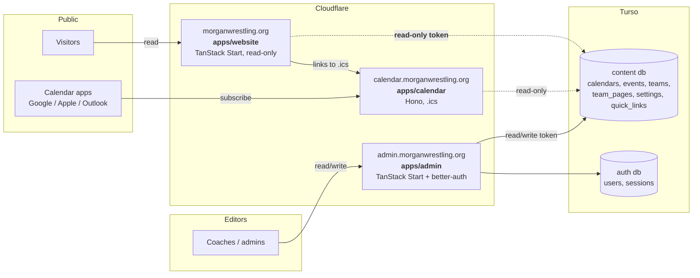
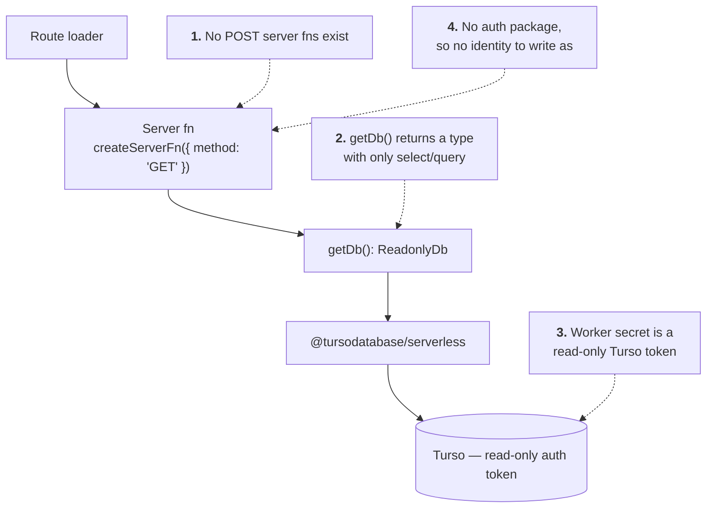
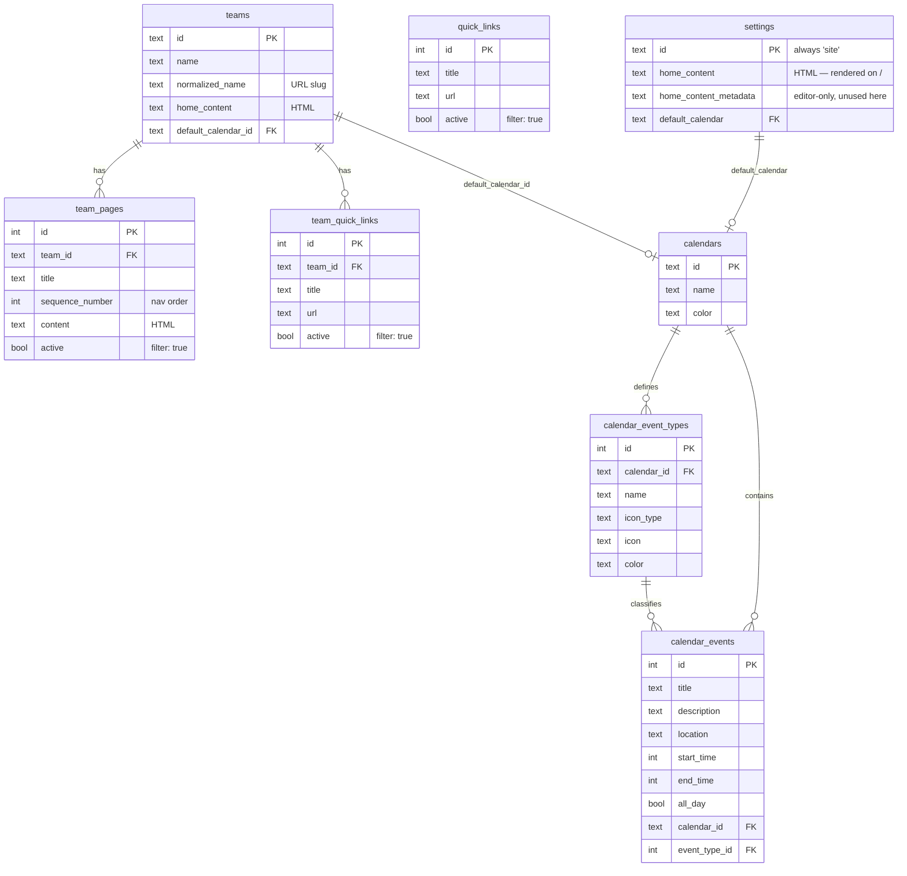
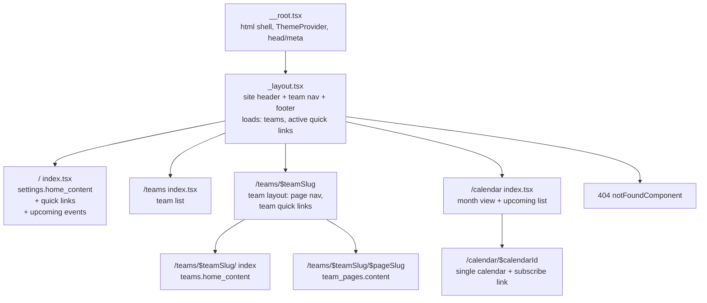

# `@morgan-wrestling/website`

The public, read-only face of Morgan Wrestling. A TanStack Start app on
Cloudflare Workers that renders whatever the admin app has written into Turso —
site home content, teams and their pages, quick links, and the calendar — and
never writes a row back.

> **Status: plan only.** Nothing in this directory is implemented yet. This file
> is the design and the build order. Delete the "Milestones" section once the
> app ships.

---

## 1. Goals and non-goals

### Goals

- Render the site content authored in `apps/admin` for anonymous visitors.
- Server-render everything. This is a content site — it should be fast, crawlable,
  and readable with JavaScript off.
- Be structurally incapable of mutating the database, at more than one layer.
- Reuse the workspace packages (`db`, `ui`, `styles`) rather than growing a
  parallel copy of them.

### Non-goals

- **No authentication.** `@morgan-wrestling/auth` is deliberately not a
  dependency. There are no sessions, no cookies, no user rows, and no
  `BETTER_AUTH_*` secrets on this Worker. Every visitor sees the same page.
- **No writes.** No `createServerFn({ method: 'POST' })`, no forms, no mutations.
- **No `.ics` generation.** `apps/calendar` already serves subscribable
  calendars at `calendar.morganwrestling.org`; the website links to it.
- **No admin-only content.** Rows flagged inactive (`team_pages.active`,
  `quick_links.active`, `team_quick_links.active`) are filtered out server-side.

---

## 2. Where it sits



Three Workers, one content database, one writer. The website and the calendar
worker are both pure readers; only the admin app holds a read/write token.

---

## 3. Stack

Matched to `apps/admin` so the two apps stay maintainable together, minus
everything auth- and mutation-shaped.

| Concern | Choice | Notes |
| --- | --- | --- |
| Framework | TanStack Start (`@tanstack/react-start`) | File-based routing, server functions, SSR. |
| Runtime | Cloudflare Workers via `@cloudflare/vite-plugin` | Same as admin: `main: "@tanstack/react-start/server-entry"`. |
| Build | Vite 8 | `resolve.tsconfigPaths` + the admin's `optimizeDeps` workaround if a transitive dep bites. |
| Data | `@morgan-wrestling/db` (drizzle + `@tursodatabase/serverless`) | Schema and query helpers come from the package; the app never depends on `drizzle-orm` directly. |
| Data fetching | Router loaders + `@tanstack/react-query` + `@tanstack/react-router-ssr-query` | Mirrors `apps/admin/src/router.tsx`. |
| UI | `@morgan-wrestling/ui`, `@morgan-wrestling/styles` | Shared shadcn/base-ui components and the design tokens. |
| Styling | Tailwind v4 + `@tailwindcss/typography` | Typography is **new** here — see §7. |
| Env | `@t3-oss/env-core` + zod | Same shape as `apps/calendar/src/env.ts`, which is the minimal one. |
| Lint/format | Root Biome | Tabs, single quotes, sorted classes. Nothing app-local. |
| Tests | Vitest + Testing Library | Loader/query-shape tests and a couple of render smoke tests. |

### Dependencies to add

```jsonc
{
  "dependencies": {
    "@fontsource-variable/geist": "*",
    "@morgan-wrestling/db": "workspace:*",
    "@morgan-wrestling/styles": "workspace:*",
    "@morgan-wrestling/ui": "workspace:*",
    "@t3-oss/env-core": "*",
    "@tanstack/react-query": "*",
    "@tanstack/react-router": "*",
    "@tanstack/react-router-ssr-query": "*",
    "@tanstack/react-start": "*",
    "date-fns": "*",
    "lucide-react": "*",
    "react": "*",
    "react-day-picker": "*",
    "react-dom": "*",
    "zod": "*"
  }
}
```

Match the versions already pinned in `apps/admin/package.json` — one resolved
copy of React/Router/Query across the workspace is the point.

Deliberately **absent**: `@morgan-wrestling/auth`, `@tanstack/react-form`,
`@tanstack/react-form-start`, `nanoid`, `jotai`. If a future change wants any of
them, that is a signal the app is drifting out of its read-only lane.

---

## 4. Read-only, enforced in four places

"Read only" is a property that has to be defended, not just intended. Four
independent layers, so no single mistake makes the site writable:



**1 — No write server functions.** The app defines only
`createServerFn({ method: 'GET' })` handlers under `src/lib/*-fns.ts`. Reviewing
this is a one-line grep, which is the point.

**2 — A narrowed db handle.** `src/db/index.ts` deliberately does *not*
re-export the full drizzle instance:

```ts
import { createAppDb } from '@morgan-wrestling/db';
import { env } from '#/env';

export * from '@morgan-wrestling/db/schema';

type AppDb = ReturnType<typeof createAppDb>;
/** Only the reading half of the drizzle surface. `insert`/`update`/`delete`
 *  are not on this type, so a write is a compile error, not a runtime 403. */
export type ReadonlyDb = Pick<AppDb, 'select' | 'selectDistinct' | 'with'>;

/**
 * Builds a request-scoped, read-only app db. Call it inside a handler; never
 * hoist the result to module scope — a shared `@tursodatabase/serverless`
 * connection leaks its `AsyncLock` continuations across requests and hangs the
 * Worker. (Same constraint as `apps/admin/src/db/index.ts`.)
 */
export function getDb(): ReadonlyDb {
  return createAppDb(env.TURSO_CONNECTION_URL, env.TURSO_TOKEN);
}
```

Confirm the exact key names against the installed `drizzle-orm@1.0.0-rc.4`
when implementing — `Pick` on a name that does not exist is a silent no-op.

**3 — A read-only Turso token.** The Worker secret is minted with
`turso db tokens create <db> --read-only`. Even a bug that got past layers 1–2
fails at the database. This is the only layer that is not bypassable from inside
the codebase, so it is the one that actually matters.

**4 — No writer identity.** Every mutable table carries `created_by`/`updated_by`
sourced from a better-auth session. With no auth package there is no session and
nothing valid to put in those columns.

---

## 5. The read surface

Everything the site renders, and nothing else:



Never selected: `created_by`, `updated_by`, `*_content_metadata` (the
ProseMirror JSON the editor round-trips), and anything from the auth database.
Select explicit column lists, as `apps/admin/src/lib/*-fns.ts` does — it keeps
audit columns off the wire and makes the public surface obvious at the call site.

---

## 6. Routes



Plus two non-React responses:

- `/robots.txt` — allow all, point at the sitemap.
- `/sitemap.xml` — generated from teams + active team pages, via a route
  `server.handlers.GET` (see the "API Routes" pattern in the root `README.md`).

### The `$pageSlug` problem

`team_pages` has `title` and `sequence_number` but **no slug column**, and titles
are not unique per team. Three options:

| Option | URL | Cost |
| --- | --- | --- |
| **A.** Numeric id | `/teams/varsity/7` | Ugly, and page ids leak. No schema change. |
| **B.** Slugify the title at read time | `/teams/varsity/schedule` | Pretty. Ambiguous if two pages in a team normalize to the same slug. |
| **C.** Add `team_pages.slug` (unique per team) | `/teams/varsity/schedule` | Correct. Needs a migration + an admin field. |

**Recommendation: B now, C later.** Slugify with the same
`name.toLowerCase().replace(/\s+/g, '-')` rule `apps/admin/src/lib/team-fns.ts`
uses for teams, resolve server-side by comparing normalized titles, and on a
collision take the lowest `sequence_number` (matching the nav order the visitor
clicked). Ship C as a follow-up in the admin app when someone actually hits a
collision; the route shape does not change when it lands.

Teams themselves already have `normalized_name`, so `$teamSlug` needs no such
gymnastics.

### Request flow

```mermaid
sequenceDiagram
    participant B as Browser
    participant W as Worker (TanStack Start)
    participant L as Route loader
    participant F as Server fn (GET)
    participant D as getDb() — ReadonlyDb
    participant T as Turso (read-only)

    B->>W: GET /teams/varsity/schedule
    W->>L: match route, run loader
    L->>F: ensureQueryData(teamPageQueryOptions)
    F->>D: getDb()  (per request, never hoisted)
    D->>T: SELECT ... WHERE normalized_name = ? AND active = 1
    T-->>D: rows
    F-->>L: plain JSON (no audit columns)
    L-->>W: dehydrated query cache
    W-->>B: streamed HTML + hydration payload
    Note over B,W: Client navigations reuse the<br/>same query cache; no refetch<br/>within staleTime.
```

Loaders call `queryClient.ensureQueryData(...)` so the same query options serve
SSR and client navigation, exactly as the admin app does via
`setupRouterSsrQueryIntegration`.

---

## 7. Rendering authored content

`home_content` and `team_pages.content` are **HTML strings** produced by the
Tiptap editor — `packages/ui/src/components/text-editor/types.ts` says so
outright: *"`html` is what gets rendered on the public site"*. The sibling
`*_metadata` column holds the ProseMirror JSON and is editor-only; the website
ignores it.

So rendering is `dangerouslySetInnerHTML` inside a typography container:

```tsx
<article
  className='prose prose-neutral dark:prose-invert max-w-none'
  // biome-ignore lint/security/noDangerouslySetInnerHtml: authored HTML from
  // the admin editor, sanitized on the way out of the server fn.
  dangerouslySetInnerHTML={{ __html: html }}
/>
```

Two things this needs:

1. **`@tailwindcss/typography` must actually be loaded.** It is in the admin's
   devDependencies but no stylesheet references it, and `prose` is used nowhere
   in the repo today. Add `@plugin "@tailwindcss/typography";` to the website's
   `src/styles.css` (app-local, so the admin's bundle is unaffected).

2. **Sanitize server-side.** The authors are trusted admins, so this is
   defense-in-depth rather than a live threat — but the site is anonymous and
   cached, so a single bad paste would be served to everyone. Run the HTML
   through a small allowlist sanitizer in the server function, before it
   crosses to the client. Pick a Workers-compatible one (no DOM): evaluate
   `ultrahtml/transformers/sanitize` or a hand-rolled allowlist over the tags
   the Tiptap extension set can actually emit (`packages/ui/.../extensions`:
   headings, blockquote, highlight, image, sub/sup, tables, text-align, plus
   starter-kit). Whatever is chosen, it belongs in **one** helper —
   `src/lib/sanitize-html.ts` — that every content-returning server fn calls.

---

## 8. Calendar display

The calendar pages read from the same tables `apps/calendar` does. A visitor can:

- see a month grid with per-day event dots coloured by
  `calendar_event_types.color` (the `--calendar-*` tokens and the
  `calendarColors` map in `packages/ui/src/components/calendar/calendar-utils.ts`
  already exist for this),
- see an upcoming-events list with title, time, location, and type,
- click **Subscribe** → `https://calendar.morganwrestling.org/<calendarId>/calendar.ics`.

Queries are bounded by a date window, the same overlap logic
`apps/calendar/src/fns/create-calendar.ts` uses — keep any event that intersects
the window rather than only those fully inside it:

```ts
and(
  eq(calendarEvents.calendarId, calendarId),
  gte(calendarEvents.endTime, windowStart),
  lte(calendarEvents.startTime, windowEnd),
)
```

`apps/admin/src/components/big-calendar.tsx` is a scaffold with hard-coded dots,
not a reusable component. If the month grid ends up shared between the two apps,
promote a real one into `packages/ui`; until then build it in the website and
leave the admin's alone.

---

## 9. Caching and freshness

Content changes a few times a week; traffic is bursty around events. Layers,
cheapest first:

| Layer | Setting | Effect |
| --- | --- | --- |
| Query client | `staleTime: 5 * 60 * 1000` | No refetch on client navigation within the window. |
| Document response | `Cache-Control: public, max-age=0, s-maxage=300, stale-while-revalidate=3600` | Cloudflare's edge serves the HTML; a stale page refreshes in the background. |
| Static assets | Vite's hashed filenames + immutable | Free. |

**There is no cache invalidation.** `caches.default.delete()` only purges the
colo that runs it, so the admin app cannot bust the website's edge cache after
an edit — the same constraint that is documented in `apps/calendar/src/index.ts`.
The TTL is the whole freshness story, which is why 300s (not an hour). If
editors need faster feedback later, the options are a Cloudflare cache-tag purge
from the admin app (paid feature) or dropping `s-maxage` and leaning on
`stale-while-revalidate` alone.

Note the same caveat as the calendar worker: the edge cache is a no-op on
`*.workers.dev`. Testing cache behaviour requires the custom domain.

---

## 10. Layout

```
apps/website/
├── README.md                  ← this file
├── package.json
├── tsconfig.json              ← extends ../../tsconfig.base.json, "#/*" + ui path map
├── vite.config.ts             ← devtools, cloudflare, tailwind, tanstackStart, react
├── wrangler.jsonc             ← name: morgan-wrestling-website
├── .env.example
├── public/
│   ├── favicon.ico
│   └── ...
└── src/
    ├── router.tsx
    ├── styles.css             ← @import styles pkg; @plugin typography
    ├── env.ts                 ← TURSO_CONNECTION_URL, TURSO_TOKEN, VITE_APP_TITLE
    ├── db/
    │   └── index.ts           ← getDb(): ReadonlyDb
    ├── lib/
    │   ├── sanitize-html.ts
    │   ├── slug.ts            ← shared normalize() for team + page slugs
    │   ├── site-fns.ts        ← settings + quick links (GET)
    │   ├── site-opts.ts
    │   ├── team-fns.ts        ← teams, team pages, team quick links (GET)
    │   ├── team-opts.ts
    │   ├── calendar-fns.ts    ← calendars, event types, windowed events (GET)
    │   └── calendar-opts.ts
    ├── components/
    │   ├── site-header.tsx
    │   ├── site-footer.tsx
    │   ├── rich-content.tsx   ← the one prose + dangerouslySetInnerHTML site
    │   ├── quick-links.tsx
    │   ├── event-list.tsx
    │   └── month-calendar.tsx
    ├── integrations/
    │   └── tanstack-query/root-provider.tsx
    └── routes/
        ├── __root.tsx
        ├── _layout.tsx
        ├── _layout/index.tsx
        ├── _layout/teams/index.tsx
        ├── _layout/teams/$teamSlug.tsx
        ├── _layout/teams/$teamSlug/index.tsx
        ├── _layout/teams/$teamSlug/$pageSlug.tsx
        ├── _layout/calendar/index.tsx
        ├── _layout/calendar/$calendarId.tsx
        ├── robots[.]txt.ts
        └── sitemap[.]xml.ts
```

No `_protected` tree, no `log-in` / `sign-up` routes, no `api/auth/$` — the three
things that make the admin's route tree look the way it does are all absent here.

---

## 11. Config

### `wrangler.jsonc`

```jsonc
{
  "$schema": "node_modules/wrangler/config-schema.json",
  "name": "morgan-wrestling-website",
  "compatibility_date": "2026-09-18",
  "compatibility_flags": ["nodejs_compat"],
  "routes": [
    { "pattern": "morganwrestling.org", "custom_domain": true },
    { "pattern": "www.morganwrestling.org", "custom_domain": true }
  ],
  // The *.workers.dev subdomain bypasses the edge cache and any WAF rule, and
  // would be a second indexable origin for the same content. The custom domain
  // is the only way in.
  "workers_dev": false,
  "main": "@tanstack/react-start/server-entry",
  "observability": { "enabled": true }
}
```

Decide whether `www` redirects to the apex or serves it directly; if it
redirects, a Cloudflare bulk redirect rule is cheaper than a Worker route.

### `.env.example`

```
VITE_APP_TITLE='Morgan Wrestling'

# Read-only Turso token:
#   turso db tokens create <db> --read-only
TURSO_CONNECTION_URL=
TURSO_TOKEN=
```

Two variables. If a fifth line ever appears here, something has gone wrong with
the scope of this app.

### `.github/workflows/deploy.yml`

Two edits, per the "Adding the next app" section of `BEFORE_DEPLOY.md`:

```yaml
            website:
              - *shared
              - 'apps/website/**'
```

and `website` added to the `workflow_dispatch` `app` choices. Then push the
Worker secrets once from a local machine (`wrangler secret bulk`) — CI never
sees them.

---

## 12. Milestones

Each one ends at something runnable.

- [ ] **M1 — Scaffold.** `package.json`, `tsconfig.json`, `vite.config.ts`,
      `wrangler.jsonc`, `src/env.ts`, `src/styles.css`, `src/router.tsx`,
      `__root.tsx` with a hard-coded hello. `bun --bun run dev` serves it.
- [ ] **M2 — Read-only data layer.** `src/db/index.ts` with `ReadonlyDb`,
      `site-fns.ts` returning `settings` + active `quick_links`, sanitizer
      helper. Verify a write is a *type* error, not a runtime one.
- [ ] **M3 — Home page.** `_layout.tsx` (header/footer/nav) and `/` rendering
      site home content + quick links. Real content visible end to end.
- [ ] **M4 — Teams.** `/teams`, `/teams/$teamSlug`, `/teams/$teamSlug/$pageSlug`,
      with the slug resolution from §6 and `active` filtering. 404s for unknown
      or inactive slugs.
- [ ] **M5 — Calendar.** `/calendar` and `/calendar/$calendarId` — month grid,
      upcoming list, subscribe link to the calendar worker.
- [ ] **M6 — Polish.** `head`/meta per route (title, description, OG tags),
      `robots.txt`, `sitemap.xml`, 404 page, cache headers from §9, Lighthouse
      pass, no-JS check.
- [ ] **M7 — Deploy.** Read-only Turso token minted, Worker secrets pushed,
      `deploy.yml` filter + dispatch choice added, custom domain attached,
      `BEFORE_DEPLOY.md` updated with the website's (much shorter) setup.

---

## 13. Open questions

1. **Apex vs. `www`** — which is canonical, and does the other redirect?
2. **Which calendars are public?** `settings.default_calendar` and
   `teams.default_calendar_id` point at specific ones, but `calendars` has no
   `public` flag. Listing every calendar at `/calendar` may expose internal
   ones. Options: only surface calendars reachable from a settings/team
   default, or add a `calendars.public` column in the admin.
3. **Are inactive team pages hidden or 404?** Currently assumed 404 (not listed,
   not reachable). `team_pages.active` is nullable — decide whether `NULL`
   means active or inactive and apply it consistently; the admin's
   `getTeamPages` does not filter on it today.
4. **Sanitizer choice** — needs a Workers-compatible, DOM-free library, or a
   hand-rolled allowlist. Worth a spike in M2.
5. **Slug column** — commit to option C from §6 now, or wait for a real
   collision?
6. **Do teams need an index page at all,** or should `/teams` redirect to the
   first team? Depends on how many teams there are in practice.
